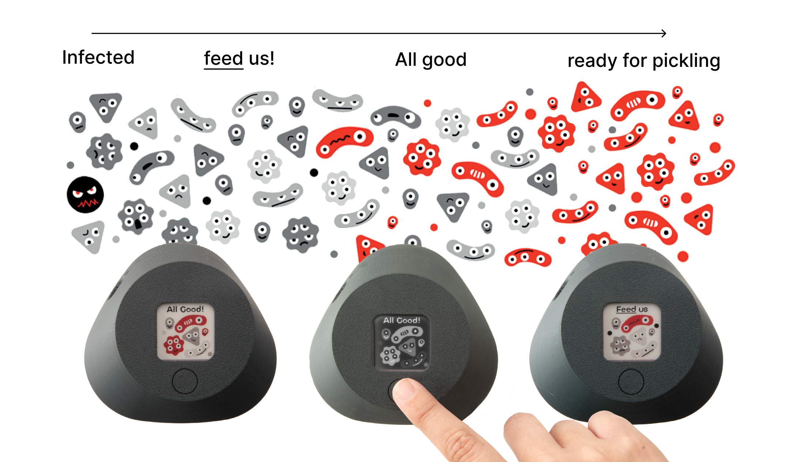
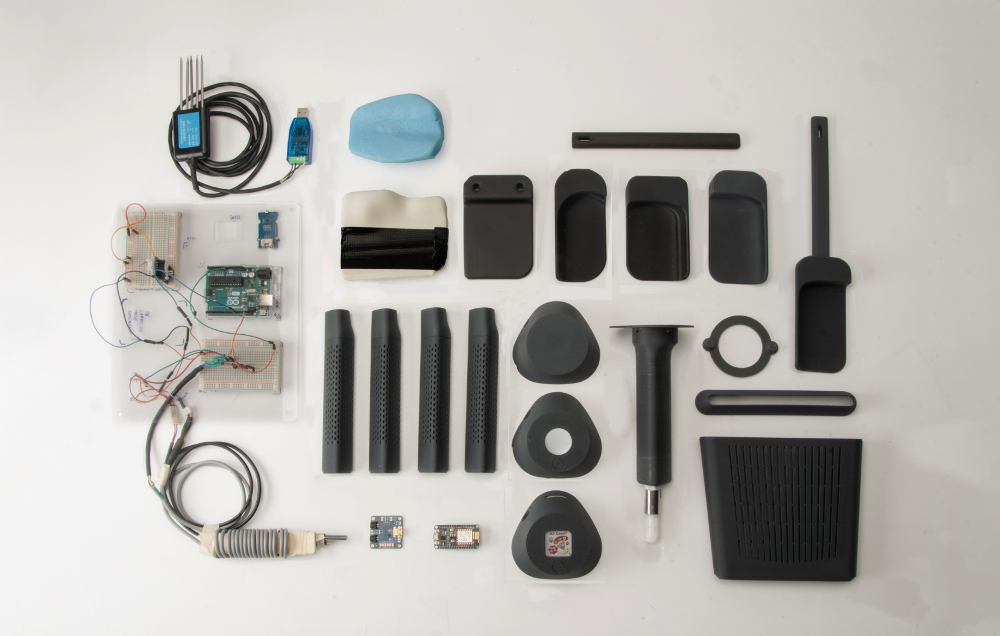

### HACKO is an open-source fermenter kit developed for the Distributed Design Platform, in collaboration with Polifactory, the Fablab of Politecnico di Milano, with the scope of offering an alternative food source for restaurants and public canteens, designed to share teachings and DIY practices and to promote methods of production of food at home. 

#### FROM WASTE TO FOOD SOURCE

A by-product of the agricolture industry is the bran, the "cover" of the seed, which is usually used in other productions or discarded.  This bran can be fermented with salt and Nori algae, thus making a compost that could then be used to make pickled vegetables, which are called [Nukazuke](https://en.wikipedia.org/wiki/Nukazuke). 

The scope of the project is to introduce this technique in Italy, by providing a user-friendly kit, making it viable for restaurants, canteens, or fermentation enthusiasts to have a waste-free food source at home.  

---

#### DEVELOPMENT

We worked for 5 months iterating with prototypes and technologies and testing them on our own production and a huge part of this process was to create an easy way to understand the needs of the fermented products,  making it so that people that were first approaching this technique could be able to easily produced and build experience over time.

To do so, we designed a housing case for the sensors and a simple interface that uses an e-ink screen to reduce the energy waste, but also to lessen the impact of technology in the design. 

---
#### INTERFACE DESIGN

For the interface design we followed the principle of making it easily understandable to everyone, but also to make it so that people would get from it an emotional response without descending too much in technical details.

Our idea was to make a discourse with the Hackos, the bacteria in the bran that communicate with their colors, and a simple message about the status of the fermented bran, making clear what action is to be taken.

#### OPEN-SOURCE CONNECTIONS

HACKO has been presented at a lot of events around the world, promoting the principles of open-source designs and fab labs in the fields of food and sustainability production.  
We presented HACKO in Lisbon at the [Gentler Food Festival](https://www.tickettailor.com/events/bytheendofmay/990542) in September 2023 and it is present in the book [Driving Design](https://distributeddesign.eu/resources/driving-design-book/) edited by the Distributed Design Platform.  
All  HACKO project files are available on the [Polifactory website](https://www.polifactory.polimi.it/en/portfolio/open-food-factory-ddp/), free to use and modify.

