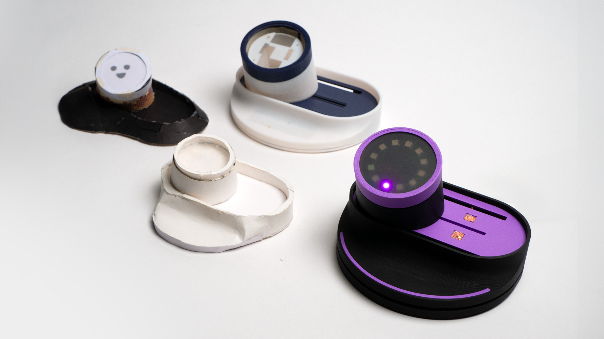
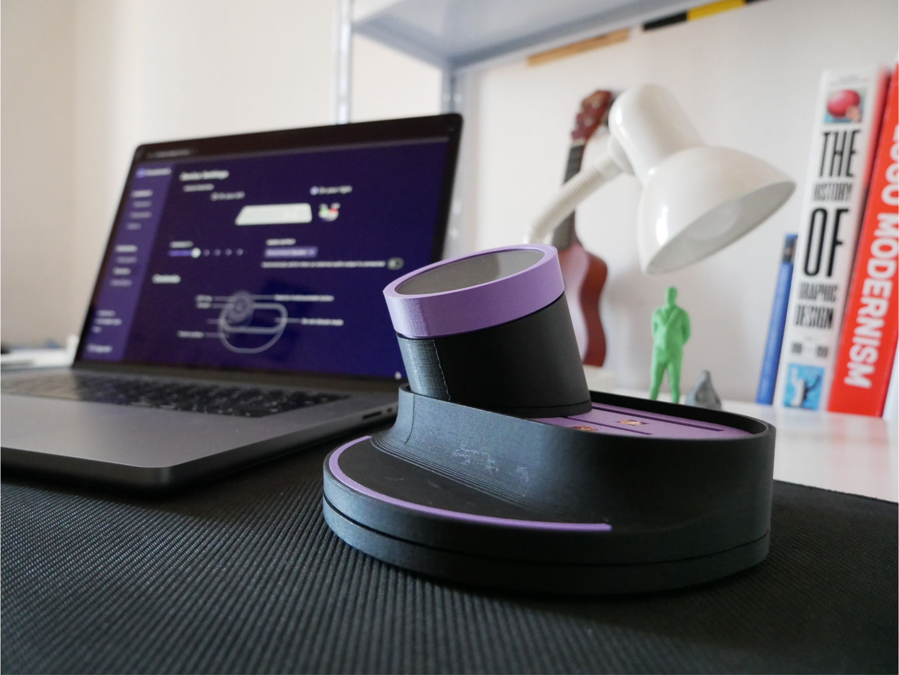

### Hybrid working has recently become an increasingly important reality in the work market, however, the phenomenon brings with it a number of risks related to the inefficiency of digital tools in bridging the gap between the physical workspace and the home workspace. Knocknock aims to improve communication and collaboration, bringing the experience closer to that of a physical workspace.

<iframe src="https://player.vimeo.com/video/981958697?badge=0&amp;autopause=0&amp;player_id=0&amp;app_id=58479" frameborder="0" allow="autoplay; fullscreen; picture-in-picture; clipboard-write" style="position:absolute;top:0;left:0;width:100%;height:100%;" title="Knocknock"></iframe>

#### WHY KNOCKING?

Knocking on someone’s door is an act of courtesy that alerts and lets you know that a conversation is about to happen, giving you time to prepare.  Similarly, in our device knocking is the very action that allows you to reach another user.

Our main objective was to make a product for [Digital Wellbeing](https://blog.google/products/android/search-jomo-new-research-digital-wellbeing/); we refer by this expression to all those aspects related to a healthy and efficient use of digital tools.
We designed to aim to bring back the **immediacy of communicating between colleagues in presence**, making the workflow more stimulating, more natural, and less focused on desktop software, allowing young workers to get the most out of their work experience even from home.

If you are more curios about the process and the project in general you can see it [here](https://knocknock-project.framer.website/).

---
#### INTERACTIONS

Physical interaction with the device is based on four simple affordances, all executable with a single hand and designed to require as little effort as possible. The physical elements that can be interacted with are also communicated by the color violet on the device.
Each of the interactions is linked to a specific set of functions so that the user learns immediately what he can expect from each action.

