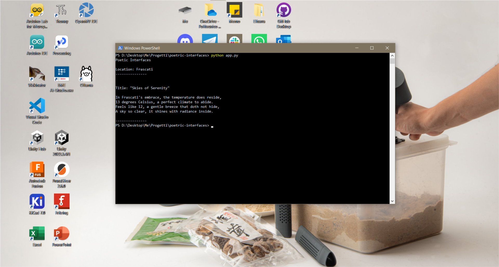
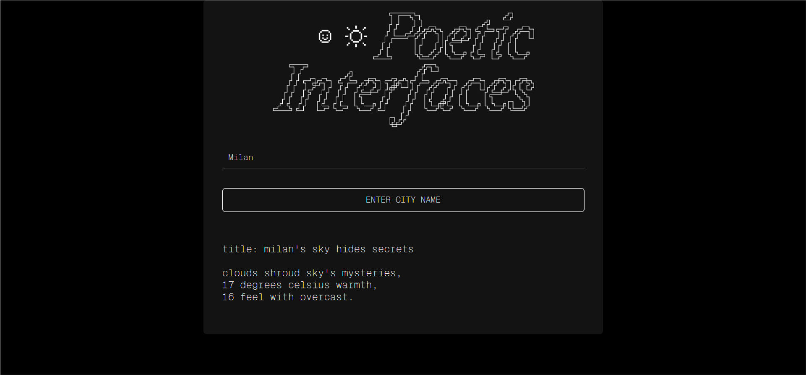
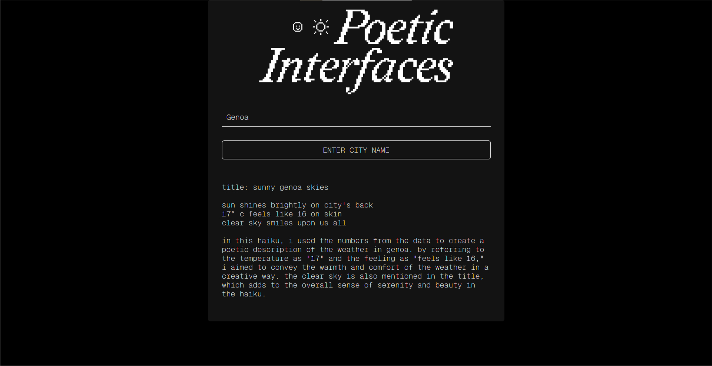

### I'm always stoked at how some apps are simply there for being as useful as possible without considering that sometimes they become excessively boring. I decided to find an interesting way of having a weather prediction that could engage me in fun ways using the power of Large Language Models

My process was really simple, I've used the open-source models paired with the [Ollama](https://ollama.com/) interface, and struct them together with API to have a simple app that could tell me the weather with a simple stanza or a haiku. The app interface and backed were all made with Python and Flask development. Right now the app is still a W.I.P. but my hope it's to have it released to the public so that other people can experiment a bit.

Here some examples of poems and prototype progression:

